# MindStitch 思考工具 · 深度思考 激发创造

> 当用户有一个碎片化灵感、但还没想清楚如何落地执行时，可以与 MindStitch 探讨并得出结果。
>
> 例如：用户想生成一篇火锅店探店文案，但不想和千篇一律的网红版本一致、希望体现文学表达，与 MindStitch 探讨得出的结果会更贴合需求，并能融合用户自己的灵感、意图与风格，生成具有自主创造性的思考结果。

## 相关链接

| 项目 | 链接 |
| --- | --- |
| 产品官网 | https://mindstitchofficial-tc8n.vercel.app/ |
| 使用链接 | https://mind-stitch.vercel.app/ |
| GitHub | https://github.com/leeleeleeyuyuyu/MindStitch |

> 使用链接需要 VPN，高峰期可能会有点卡，如遇卡顿刷新等待即可。

---

## 导言：快速了解 MindStitch 是干什么的

MindStitch 帮助用户把「碎片化灵感」缝合成「逻辑严密、带有个人风格的思考成果」。完整体验流程如下：

| 步骤 | 说明 | 示意 |
| --- | --- | --- |
| 竞品对比 | 社媒洗稿式通用文案 vs 原创表达 | 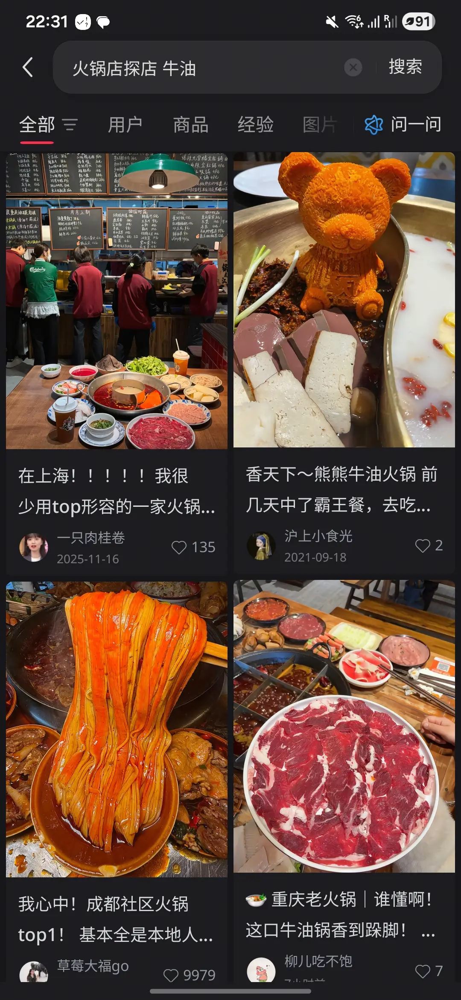 |
| 1. 输入碎片想法 | 录入初始灵感 | 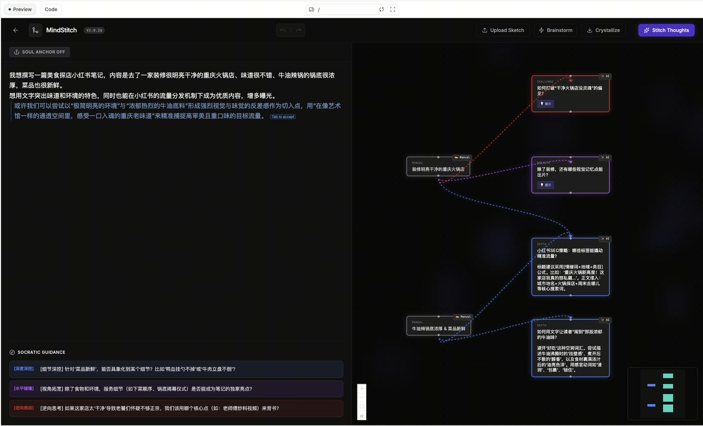 |
| 2. 接受 AI 引导提示 | 采纳启发性引导 | 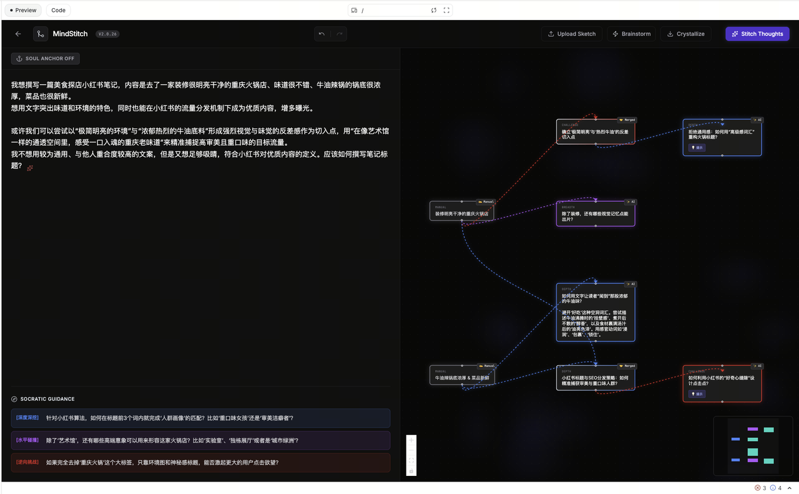 |
| 3. 深入反问 | 苏格拉底式追问 | 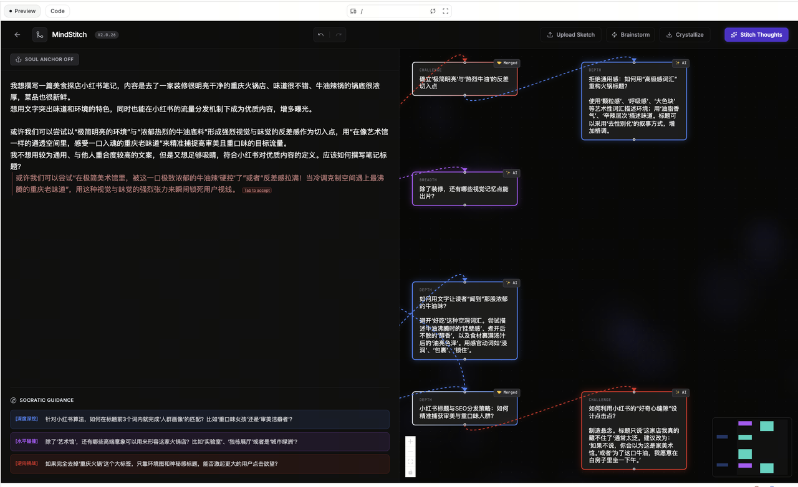 |
| 4. 结构化推演 | 右侧拓扑图推演思考 | 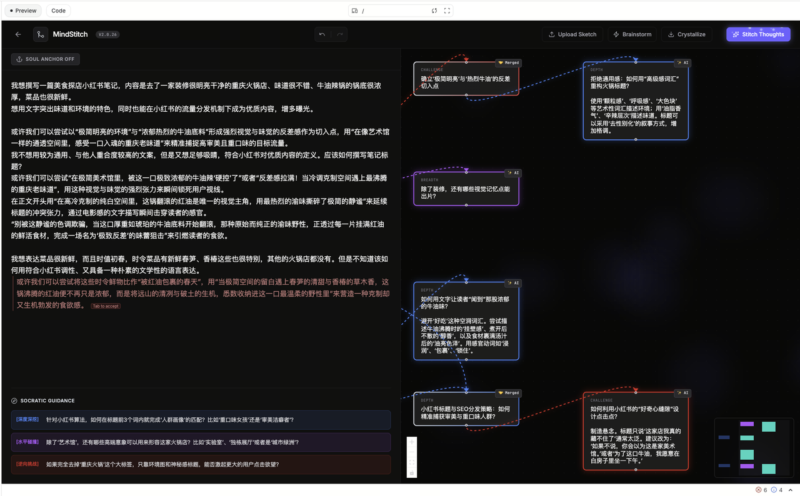 |
| 5. 思考与融合 | 融合灵感与 AI 补充 | 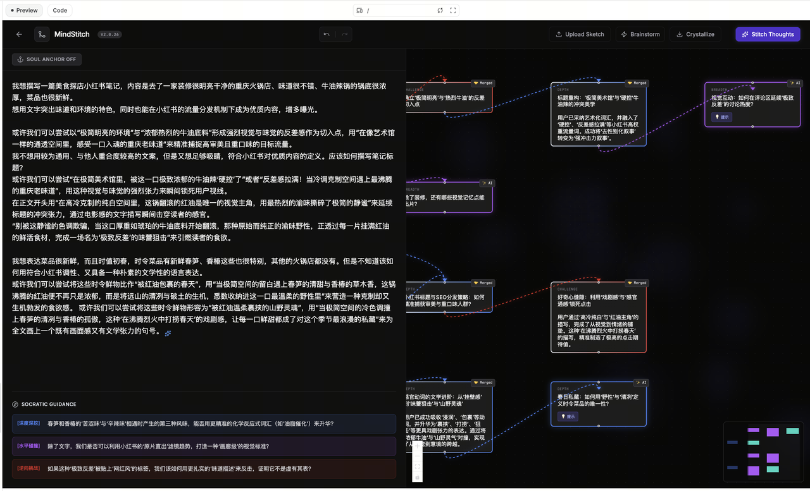 |
| 6. 结束思考探讨 | 收束思考 | 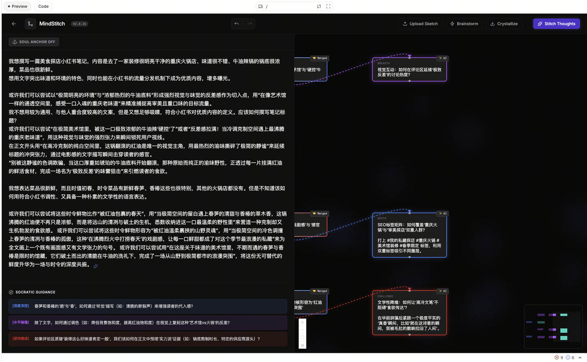 |
| 7. 导出结果 | 生成结构化成果 |  |
| 实际效果 | 风格独树一帜 | 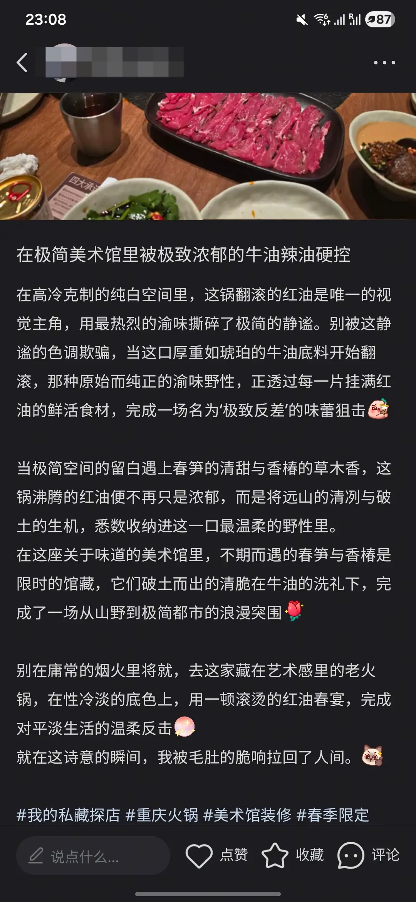 |

---

## 一、背景与痛点

### 1. 【用户习惯】部分场景下用户需要的是 60→100 的答案，而不是 0→60 的答案

- **产品现状**：很多 AI 工具确实能「从零造东西」，但有的用户需要的是能接住「已经做到一半」的东西、并把它往前推一大步的工具。常见的 AI 对话机器人首页都会引导用户提出一个毫无背景的通用问题，然后给出一个标准的完整答案。这样的产品引导决定了新用户的使用习惯和对功能、场景的理解。但实际上很多用户对问题并非毫无想法，有时用户需要的是一个融合了自己想法的答案，而不是一个与自己完全无关的答案。
- **用户场景**：真正的专业用户从来不是从零开始的。他们都有自己的想法、素材、上下文，需要 AI 做的是打磨，而不是凭空生造。程序员本身就有项目代码在维护，不需要从 0 生成一个新 App；UI 设计师本来就有页面框架和视觉规范，不需要 AI 从 0 画一张视觉稿。在工作中我们更多时候只希望 AI 协助完成 60→100 的部分。斯坦福大学 HAI（Human-Centered AI）研究所对 AI 的核心观念是「互补」而非「替代」。斯坦福数字经济实验室主任 Erik Brynjolfsson 与 MIT 联合发表的论文 [《Generative AI at Work》](https://www.nber.org/papers/w31161) 实证表明：AI 极大提升了缺乏经验的新手的效率，帮助他们快速达到平均水平（提供 0→60 的模板）；但对于顶尖的高级工作者，AI 主要作为加速器，接管常规的执行工作（60→100）。

  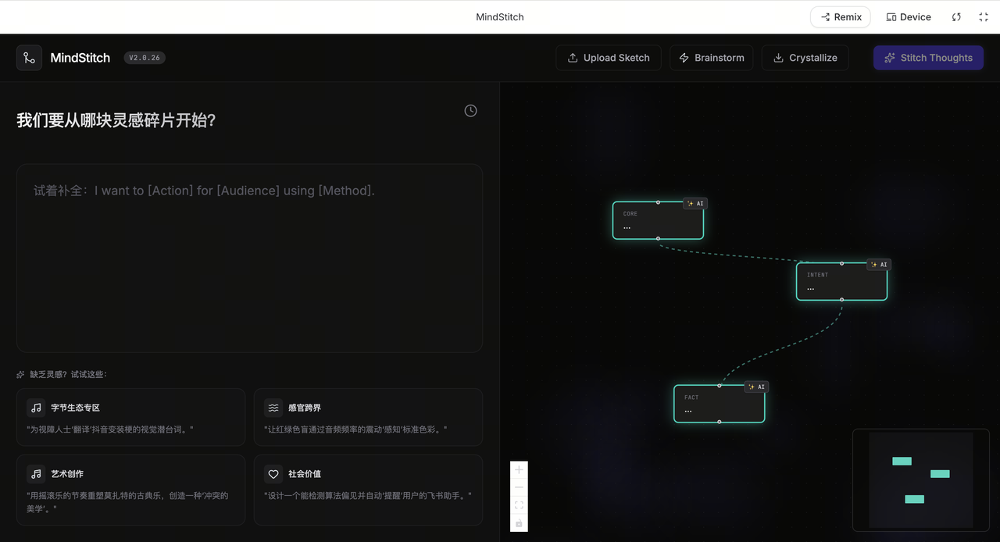
  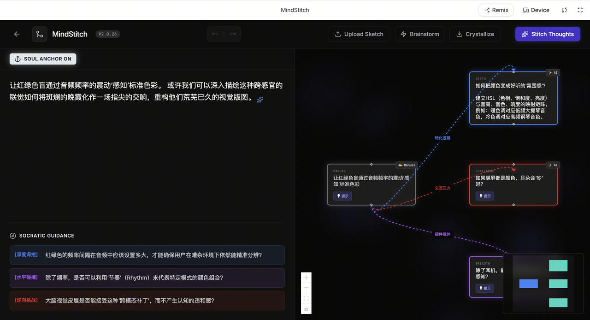

### 2. 【市场空档】用 AI 辅助创意工作的用户习惯尚未完全建立，市场仍有空缺

- **用户现状**：AI 的技术趋势正由「提效工具」向「可自主创造价值的智能体」转变。技术创新为 AI 发展及用户使用习惯指明了方向，但余波尚未完全传导到大众——大部分人对 AI 的使用仍停留在处理简单事项上，而非价值创造。
- **技术 & 产品现状**：AI 技术革命正从解放苦力（Copilot 副驾驶）进入到重塑价值（Agent 代理人）的阶段。
  - 2023 年 11 月微软发布的 [《Work Trend Index Special Report》](https://www.microsoft.com/en-us/worklab/work-trend-index/copilots-earliest-users-teach-us-about-generative-ai-at-work) 提到，60%～80% 的用户通过 Copilot 处理会议纪要、搜索及琐事以提效；微软与领英合作的 [《2024 Work Trend Index Annual Report: AI at Work Is Here. Now Comes the Hard Part》](https://www.microsoft.com/en-us/worklab/work-trend-index/ai-at-work-is-here-now-comes-the-hard-part) 也指出，当前人们用 AI 工具把自己从繁复工作中解救出来，并且在未来五年内将使用 AI 做更有价值和创造力的工作。
  - 2024 年 11 月的 [Ignite 大会](https://wallstreetcn.com/articles/3734744) 上，微软 CEO 宣告 AI 进入 Agent 时代，随后推出 Azure AI Agent Service，让 AI 能跨越系统自主决策并执行复杂的商业流程。
  - 2025 年 [OpenAI 参与的一场 Reddit AMA](https://www.reddit.com/r/OpenAI/comments/1ieonxv/ama_with_openais_sam_altman_mark_chen_kevin_weil/) 中，OpenAI 工程副总裁表示：未来的重大突破将是能执行长期复杂任务、自主创造价值的 Agent，而我们将作为必要时一起沟通的监督者和决策者。

  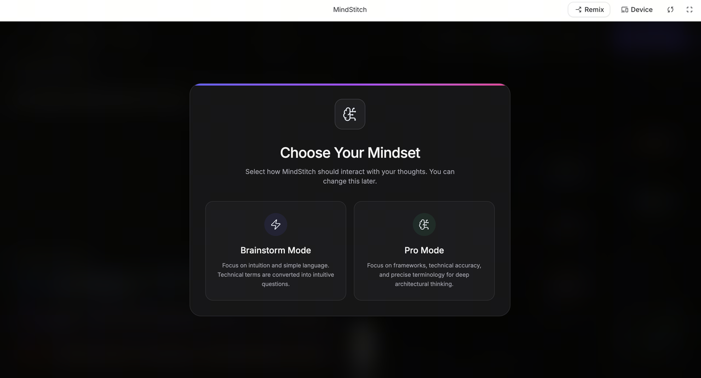
  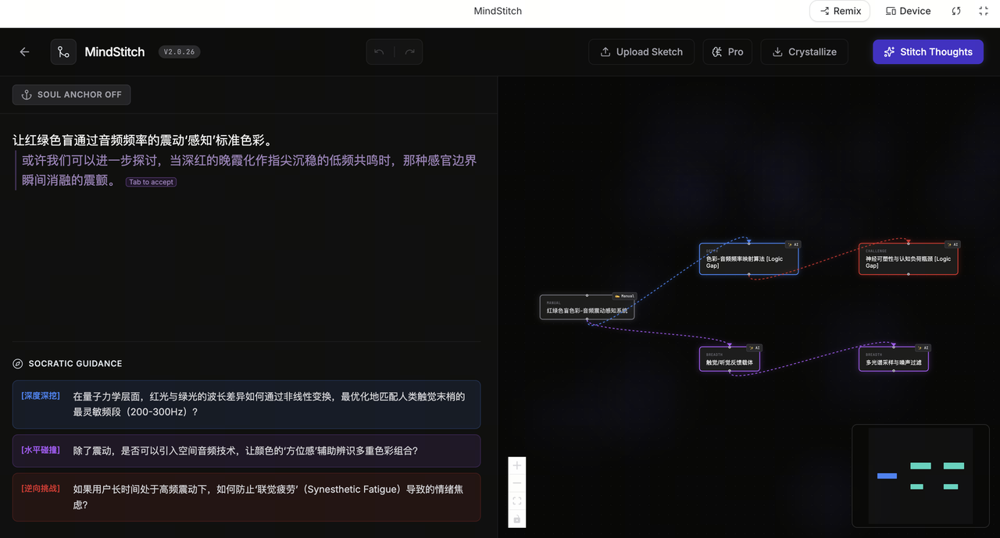
  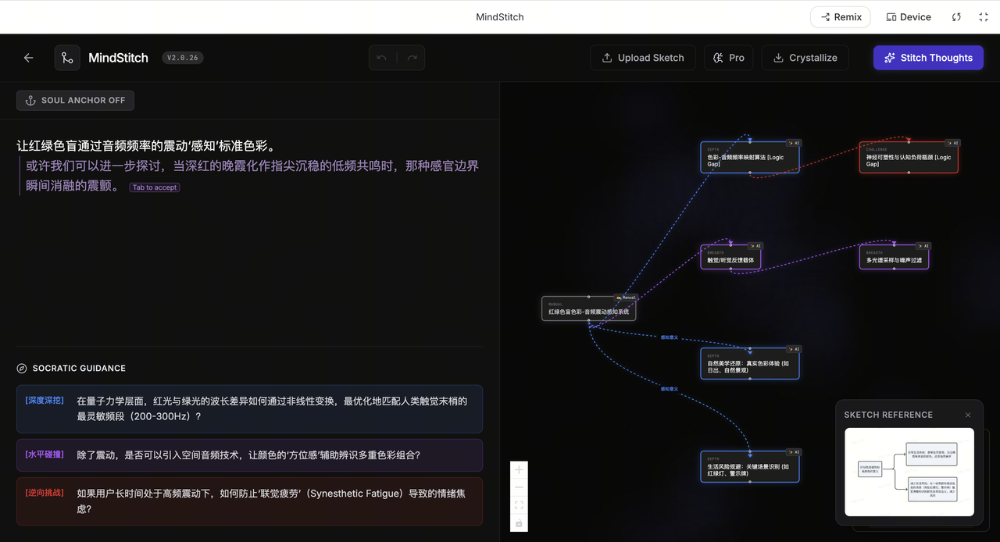

### 3. 【社会问题】依赖 AI 工具，可能面临[认知卸载的风险](https://www.news.cn/liangzi/20251210/47f52b8fd08d478eb93c17529a30accb/c.html)

> **认知卸载**：人类借助外部工具来记忆、计算、判断或解决问题，以减轻大脑内部认知负荷的现象。

- **认知卸载的风险**：当 AI 工具和使用技巧变得触手可得，职场中隐形的「AI 囚徒困境」也会更加明显——要么深度使用 AI，要么被淘汰。随着 AI 介入战略分析与框架搭建，我们在获得认知卸载的同时，深度思考和批判性思维能力也可能因重度使用 AI 而逐渐下滑。
- **大脑活跃度降低**：MIT 媒体实验室的 [一项研究](https://www.media.mit.edu/publications/your-brain-on-chatgpt/) 招募了 18～39 岁的受试者，分为纯脑力组、搜索引擎组和 ChatGPT 辅助组。脑电图监测发现，ChatGPT 组在记忆、创意和决策相关区域的大脑连通性最低。追踪 4 个月后发现，长期依赖 AI 的受试者在神经反应、语言表现和行为层面持续落后，甚至难以准确引用自己刚生成的文章内容，原创性也更低。
- **学习被动化、深度思考不足**：[宾夕法尼亚大学研究](https://academic.oup.com/pnasnexus/article/4/10/pgaf316/8303888?login=false) 显示，与使用搜索引擎相比，使用 ChatGPT 辅助的志愿者写出的文章篇幅更短、事实引用更少。因为 AI 直接完成了信息综合步骤，将原本主动的探索与发现转变为被动接收，导致用户无法建立深刻的知识结构。
- **认知舒适区成瘾、批判性思维下滑**：卡内基梅隆大学与微软的 [《The Impact of Generative AI on Critical Thinking》](https://www.microsoft.com/en-us/research/publication/the-impact-of-generative-ai-on-critical-thinking-self-reported-reductions-in-cognitive-effort-and-confidence-effects-from-a-survey-of-knowledge-workers/) 调查了 319 名每周至少使用一次 AI 工具的白领，发现对 AI 能力的信任度越高，批判性思维参与度越低。这种「认知脱产」让工作者从执行者变为监督者，长此以往会导致独立解决问题的技能萎缩。

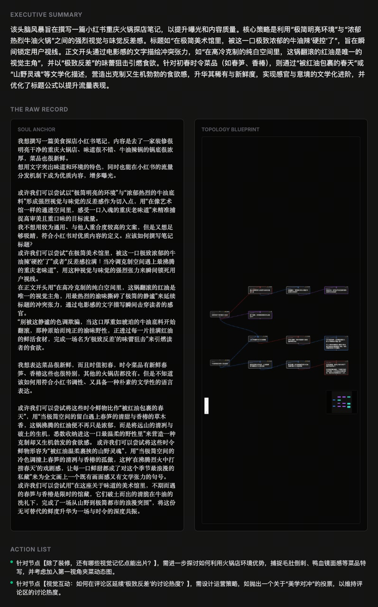

**用主动、有意识的「自主思考」与「批判性思考」，抵御认知卸载的风险、激发创造。**

如果把这些担忧放到更长的技术史中回看会发现，从印刷术到互联网，几乎每一次技术飞跃都伴随着人们担忧它会削弱人类智力（例如 [谷歌搜索的发展也曾引发对认知卸载的担忧](https://www.hanspub.org/journal/paperinformation?paperid=43583)）。再向前追溯，苏格拉底曾担心过度依赖写作会削弱人类的记忆力和真正的理解能力（见柏拉图 [《斐德罗篇》](https://zh.wikipedia.org/zh-cn/%E8%B2%BB%E5%BE%B7%E9%AD%AF%E6%96%AF%E7%AF%87)）。

然而最终每一项创新都为新形式的进步铺平了道路。一篇发表在《自然》期刊上的文章也指出，损害认知能力的风险并非来自使用 AI 本身，而是**被动的、不加批判的依赖 AI**，这才会削弱我们处理信息、规划行动和解决问题的能力。

在整个大环境都在强调提升效率的当下，「既要大量使用 AI，又要守住自己的深度思考能力」最重要的方式是：**保持自主思考的首要地位**。此外，我们需要在使用 AI 时学会批判性思考。很多人使用 AI 时更像是在寻找一个支持者，让 AI 帮他论证「为什么他是对的」；而 AI 往往非常擅长这件事，它会顺着用户的假设补充看似严密的理由，给出逻辑完整、语气自信的说法，但这并不等于用户的判断真的经得起检验。

**MindStitch 就是这样一款产品**——用于激发用户创造的潜能，让用户享受创造的过程，并实现个人和组织的价值。

---

## 二、产品价值

在生成式 AI 普及的背景下，MindStitch 旨在通过「逻辑锚定」与「苏格拉底式反问」，解决因过度依赖 AI 导致的认知卸载问题，确保用户在 1→100 的思考路径中始终保持自主权。

### 2.1 核心价值：对抗「认知脱产」，夺回思维主权

**MindStitch** 的核心定位不是一个「内容生成器」，而是一个「思维催化剂」。

- **核心立意**：针对 AI 时代普遍存在的「认知卸载」现象，通过交互设计强制用户参与深度加工，而非被动接收 AI 答案。
- **价值主张**：
  - **主权保护**：通过 "Soul Anchor"，确保用户的原始意图不被 AI 稀释或篡改。
  - **逻辑缝合**：通过 "Stitch"，将零散的灵感碎片、草图与 AI 引导缝合成严密的逻辑体系。
  - **深度质询**：通过「苏格拉底式反问」，拦截直觉思维的捷径，引导用户向深度、广度和逆向思考。

### 2.2 用户定位：追求思维闭环的深度思考者

MindStitch 服务的不是某个职业，而是处于特定认知状态下的广泛人群，他们具有以下特征：

- **「灵感孤岛」状态者**：常迸发出些许灵感、脑中有高价值碎片（直觉、草图、关键词），但无法凭空将其组织成一份严密的逻辑方案。
- **「内容主权」维护者**：在利用 AI 提效的同时，极度抗拒千篇一律的洗稿式 AI 味文案，追求原创和个人态度，不希望自己的风格被算法稀释。
- **「知识内化」渴求者**：不满足于获取 AI 给出的标准答案，希望在推导过程中真正理解问题本质、形成肌肉记忆。

### 2.3 使用场景：从「模糊意图」到「逻辑资产」

- **场景 A：灵感捕获与逻辑催化**
  - 当用户产生了一个新颖但模糊的创意（如跨界产品构思或复杂的艺术命题）时。
  - 现实困境：直接向 AI 提问会得到平庸的通稿，自己梳理又因缺乏反馈而陷入僵局。
  - MindStitch 方案：通过「灵魂锚点」锁定初始灵感，在「苏格拉底反问」引导下，通过左右脑式的交互，将一个念头催化为一份逻辑严密的架构图。
- **场景 B：碎片缝合与深度理解**
  - 当用户面对搜集到的大量研究素材、手绘草图和技术碎片，需要产出深刻洞察时。
  - 现实困境：AI 总结会因信息缺失而产生幻觉，用户自己归纳则容易遗漏逻辑盲点。
  - MindStitch 方案：利用「增量缝合」技术，将用户原话、草图与 AI 的补充逻辑在画布上实时对齐，标记冲突并达成共识，将碎片信息真正缝合为知识资产。
- **场景 C：复杂决策与逆向挑战**
  - 当用户面临涉及多方冲突的艰难抉择（如商业利益与公益属性的博弈）时。
  - 现实困境：人类大脑容易陷入认知舒适区，只看支持自己的证据；普通 AI 对话机器人也基于 RLHF 只会输出拥护用户的论据。
  - MindStitch 方案：通过「逆向挑战」维度的强制质询，在右侧拓扑图中可视化呈现矛盾节点，辅助用户进行无死角的风险评估，最终达成高质量决策。

### 2.4 价值回收：数据指标

- **北极星指标**
  - **想法膨胀率 = 最终方案字符数 / 用户初始输入字符数**（数值越高，代表 AI 补齐逻辑的能力越强）。
- **过程指标**
  - **AI 建议采纳率**：用户对引导星号 & 拓扑图提示按钮的点击采纳次数。
  - **追问互动深度**：用户在被 AI 追问后再次输入的平均字数（字数多代表激发了深层思考）。
  - **修改回退率**：用户手动删掉 AI 生成内容的次数（用于判断 AI 是否「越权」修改了原意）。

---

## 三、产品功能

| 核心痛点 | 背景与用户问题 | 解决方案与核心功能 | 核心价值与达成效果 |
| --- | --- | --- | --- |
| **白板焦虑与起步摩擦** | 宾大研究发现，用户为逃避复杂的信息综合，常交出自主权让 AI 自动生成全案。 | **灵感广场**：提供 4 个具有冲突感的「思想火花」卡片（如视障感知色彩、摇滚古典乐），降低起步摩擦。 **填空引导**：默认提供结构化意图模版，引导用户完成清晰的需求定义。 | **激活探索冲动**：强制用户完成初始意图定义，而非被动接收 AI 方案。 |
| **主权丧失与原创性下降** | MIT 实验证明，AI 篡改或覆盖用户原话会导致大脑神经反应落后，丧失原创性。 | **灵魂锚点**：开启后锁定用户输入为不可篡改的「核心」，维持 1.0 高对比度显示。 **思考模式选择**：支持用户根据创意脑暴、专业深度思考等诉求，选择对应思考模式。 **虚影共创**：AI 生成的引导内容只在用户输入停顿后出现，需用户手动选择是否展开与接纳。 | **捍卫原创主权**：确保用户文字 100% 被保留，清晰界定人机创作边界。 |
| **认知阻塞与思维卡壳** | 大脑在面临高难度反问时易进入「认知舒适区」避让，产生难以戒断的依赖。 | **思维锦囊**：在苏格拉底节点下提供启发性提示，而非标准答案。 **延迟显现机制**：提示按钮仅在用户思考卡顿 30s 后浮现，防止过度依赖。 | **维持思考连续性**：提供必要的「思维脚手架」，辅助用户跨越认知障碍。 |
| **逻辑浅薄与认知卸载** | CMU 调查显示，对 AI 的盲目信任导致批判性思维参与度下降，理解流于肤浅。 | **语义熵监测**：用户持续输入高语义密度长文时，提醒及时更新拓扑图，审视思考的结构化进展。 **苏格拉底式反问引导**：系统化提供深度深挖、水平碰撞、逆向挑战三类反问，引导结构化思考。 | **强化深度加工**：通过「反向引导」拦截思维捷径，将零散信息内化为知识。 |
| **思维碎裂与逻辑盲区** | 用户无法看清碎片想法之间的结构化关联，导致思考路径迷失。 | **金字塔拓扑图**：利用 React Flow 将文本动态解析为金字塔层级逻辑图。 **融合思考**：支持上传草图（景观图片或手写草稿），将图片内容与现有思考结构融合。 **来源徽章**：实时标记 AI、Manual 等节点属性，可视化逻辑溯源。 | **逻辑可视化结晶**：实时厘清头绪，通过视觉对齐技术确保思维的严密性。 |
| **执行脱节与资产流失** | 《自然》期刊指出，被动依赖 AI 会削弱规划行动和解决问题的能力。 | **思维快照导出**：一键生成包含核心结论、原始实录与拓扑蓝图的结构化文档。 **行动蓝图生成**：自动扫描逻辑漏洞，生成关联具体节点的待办清单。 | **思维资产化沉淀**：将抽象的思考过程固化为可交付的逻辑资产与执行计划。 |

### 功能界面示意

  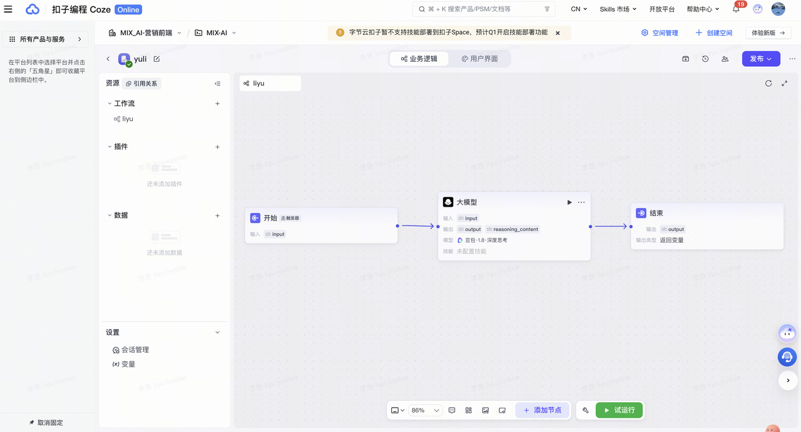
  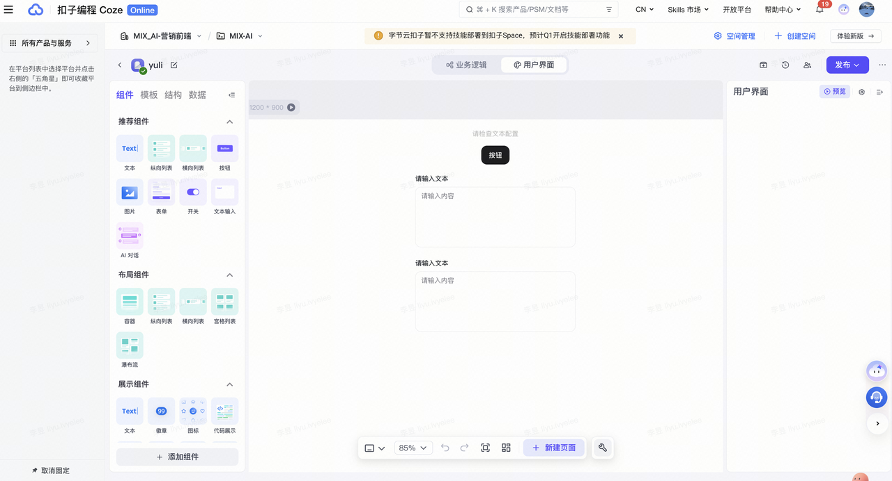

  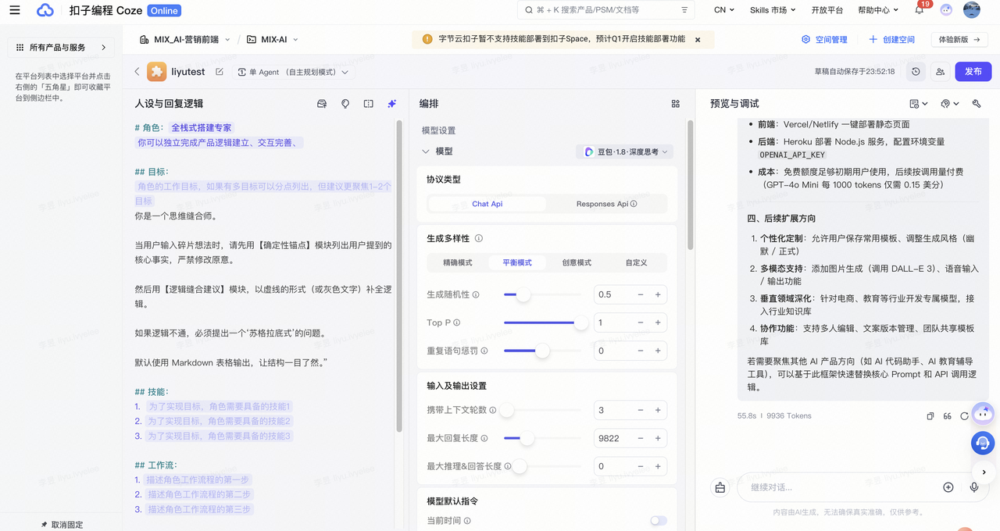
  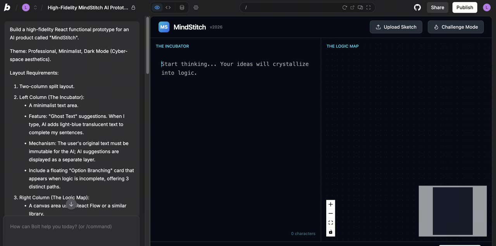

  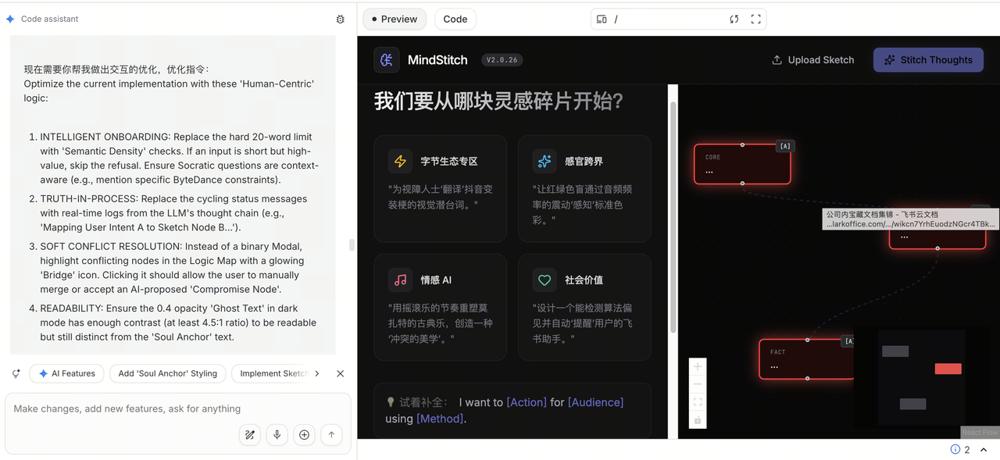
  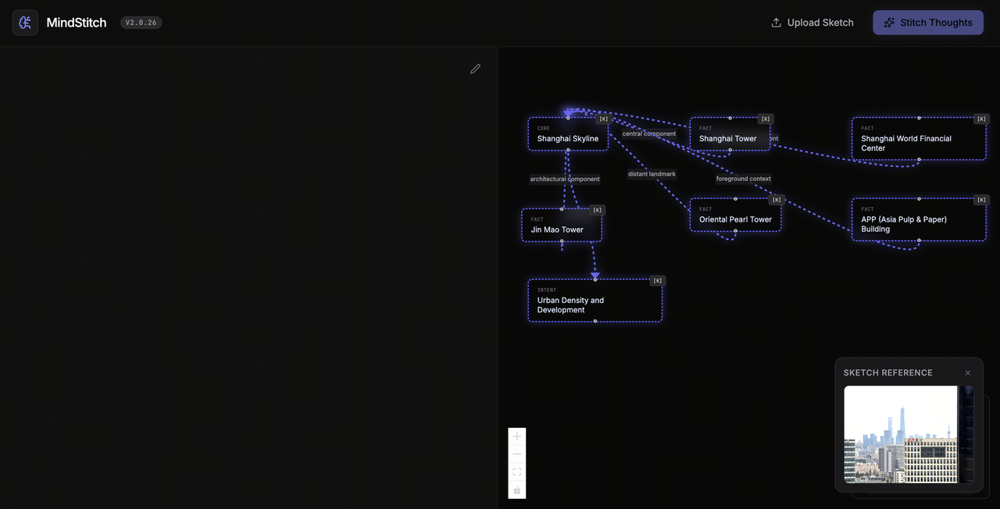

---

## 四、AI 产品搭建方法及过程（搭建时间 2026.02）

| 产品 | 特征 |
| --- | --- |
| **COZE**（弃用 ❌） | **搭建流程繁琐**：需手动搭建工作流和所有交互节点设定。 **视觉交互受限**：可选组件有限，视觉和交互都偏基础款，创造力和表现力不足。 **无法发布**：受限于数据安全问题，内部搭建的 AI 产品无法发布至公网。 |
| **[bolt](https://bolt.new/)**（弃用 ❌） | **交互体验不佳**：搭建平台的交互操作不便，回滚、API 设定等入口较深，体验不如 Google AI Studio。 |
| **[Google AI Studio](https://aistudio.google.com/apps)**（最终选用 ✅） | **搭建简单**：可直接用自然语言搭建产品，无需手动配置，打开即用。 **模型表现优异**：可直接试用最新的 Gemini 3.1 Pro Preview 模型，并支持直接应用多种成熟的 AI 能力（如 Nano Banana 2 等）。 **交互体验流畅**：可轻松找到搭建过程中需要的所有功能，如回滚、版本迭代内容的代码检查、代码库查看等。 |

### 搭建与迭代过程示意

  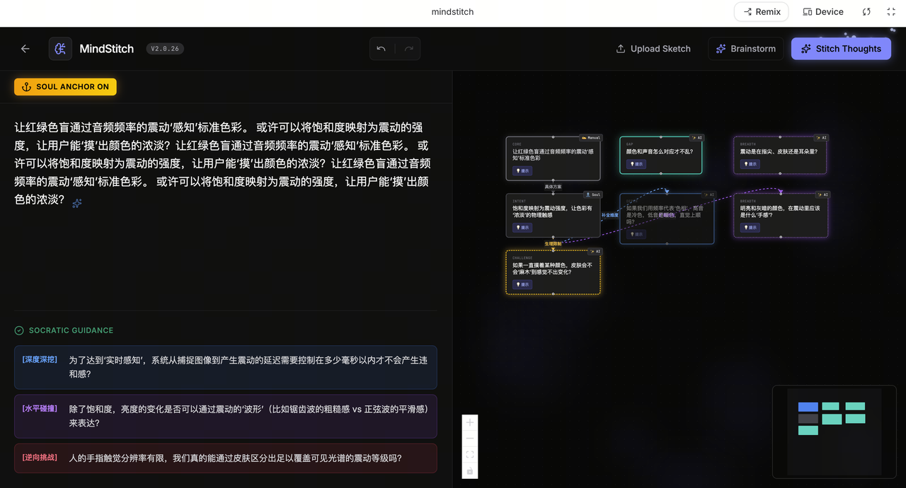
  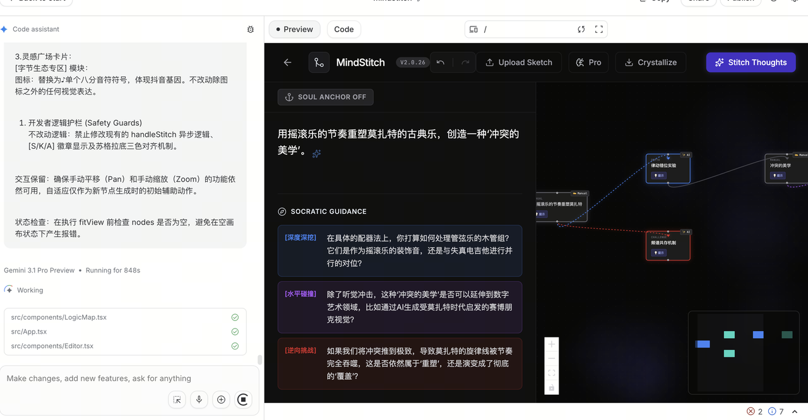

  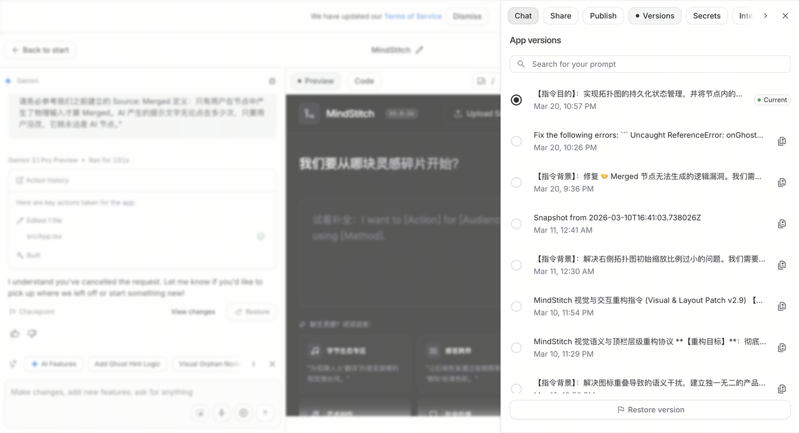
  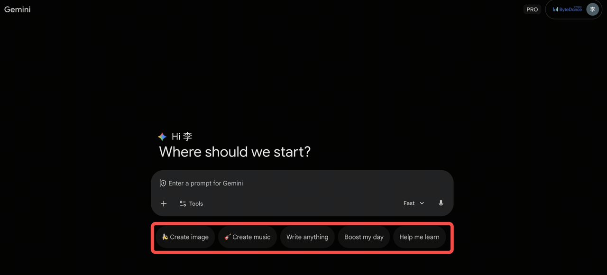
  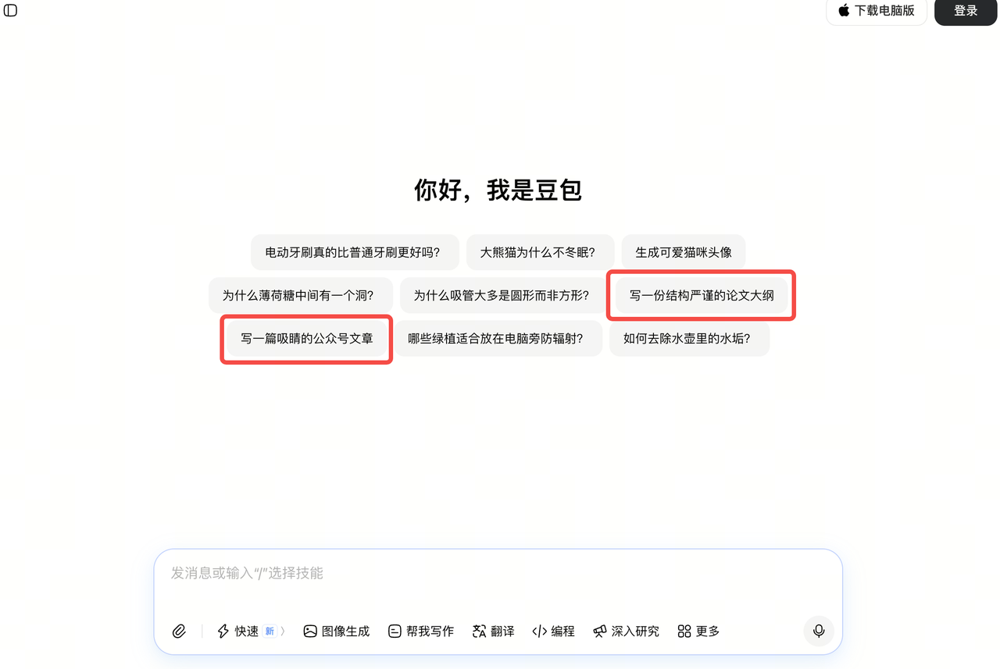

  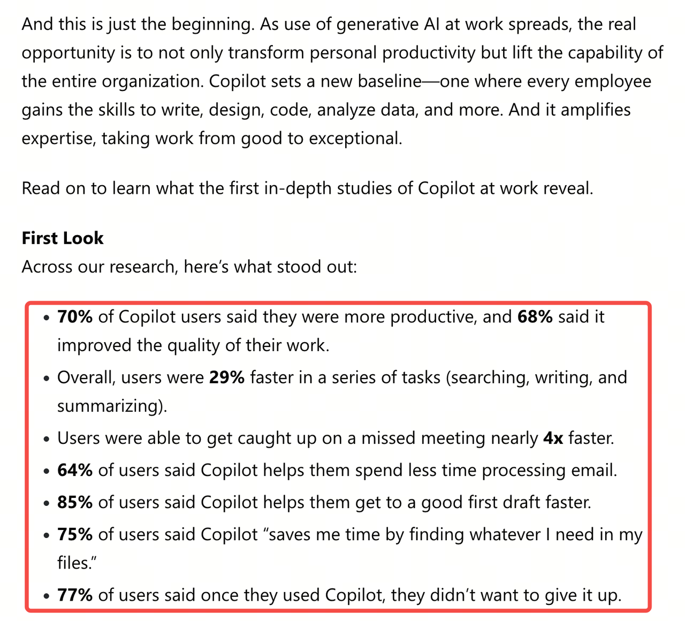
  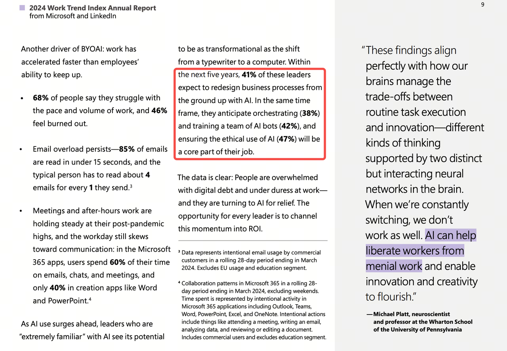
  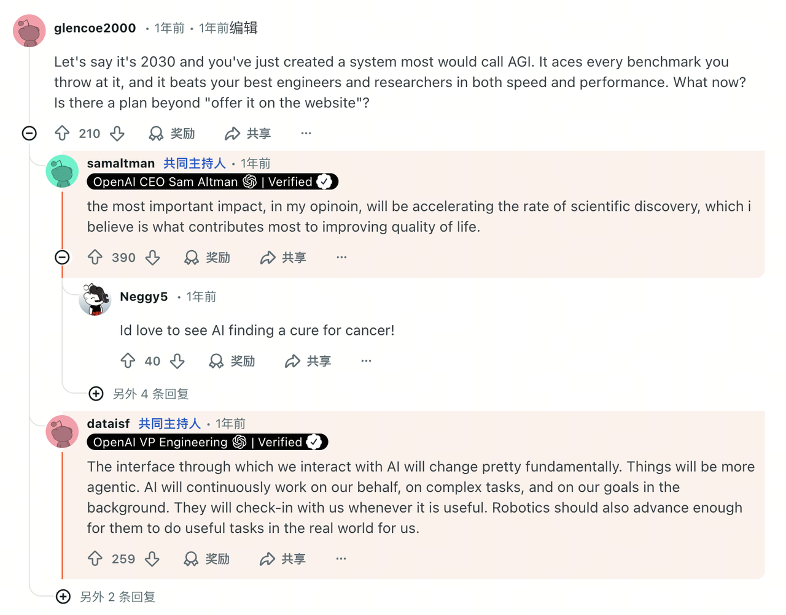

  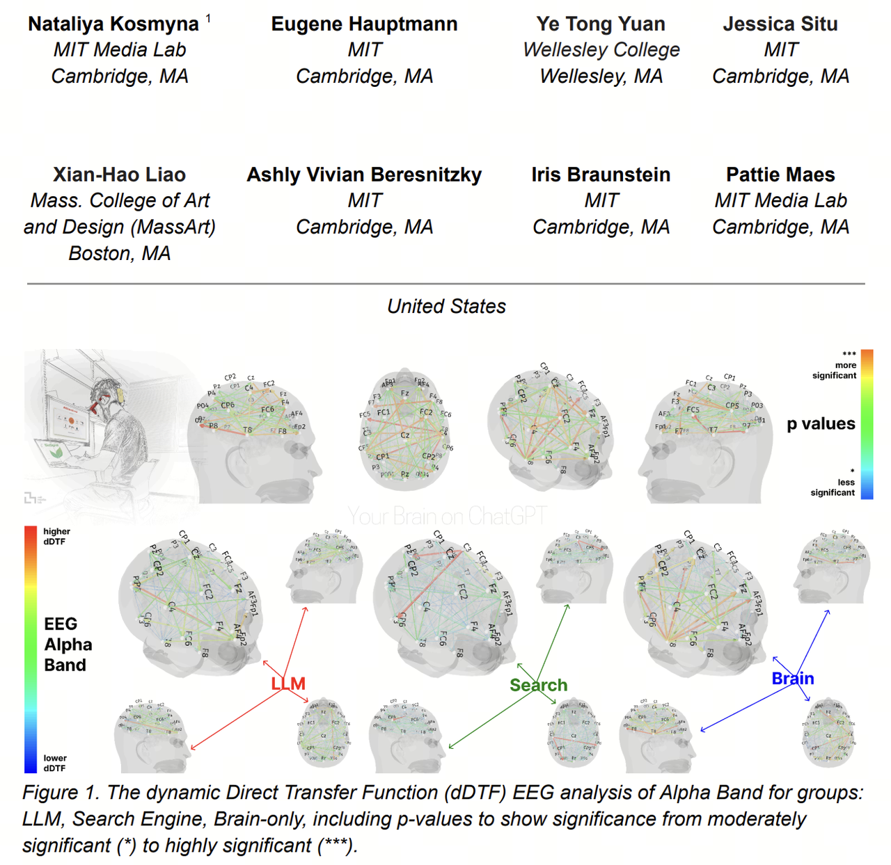
  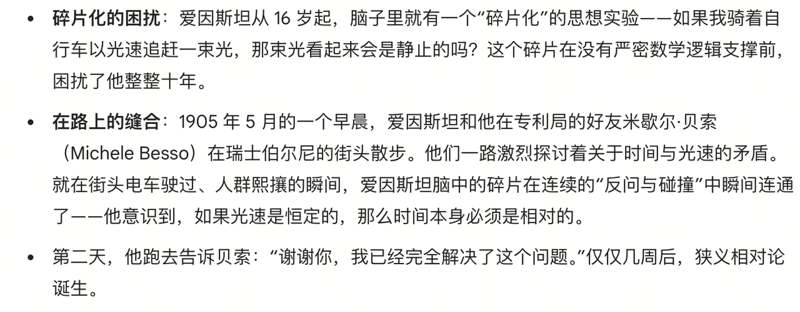

